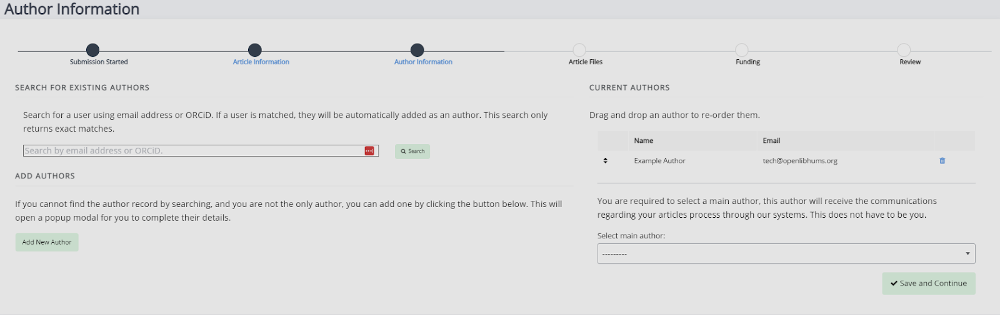

Title: Author Workflow Guide

# Author guide

This guide will walk you through the Janeway journal submission system.

## Navigating the submission process

Generally, all Janeway journals submission systems will look the same. Along the top of the page, you will see a progress bar with five stages. Once a stage has been completed, the corresponding segment of the bar will turn into a link. You can use this bar to return to an earlier screen if you need to make changes.

### New submissions

There are multiple ways to submit a journal article on Janeway:

1. If you do not have an account yet:
   - From the ‘Submission’ page on the main site (if this is not visible on a journal website, they may not be accepting submissions at this time).

2.  If you already have an account: - From the drop down menu in the top right-hand corner. This will be visible both on the journal webpage when you click ‘Account’ and within Janeway when you click on your profile in the top right-hand corner.

        - On the journal website:

    

        - On the Janeway journal platform:

    

        - From the author dashboard within Janeway.

    

If you already have an account, you will usually automatically be given the ‘Author’ role in Janeway when you submit an article. However, some journals will ask you to provide the details of the manuscript’s author or select yourself as the author manually. For more information on this, see the ‘Author Information’ section of this guide.

### The Author Agreement

The first page of the submission process is the author agreement. Depending on how a journal has been set up, this may look slightly different and not all of these fields may be displayed.

- Publication Fees
  - This is where you will see any publication fees, including Voluntary Author Contributions (VACs) or Article Processing Charges (APCs) that apply to the submission.

> [!NOTE]
> Please note that a Voluntary Author Contribution and Article Processing Charge are different. The former is entirely optional and not required in order to publish in a journal. For more information about publication fees, visit the relevant journal’s policy page(s) or contact its editorial team.

- Submission Checklist
  - The Submission Checklist will display any steps you need to take before submitting the manuscript (e.g. formatting).
- Copyright Notice
  - The Copyright Notice specifies the licence the paper will be published under and any rights you may need to sign over to the publisher.
- Competing Interests
  - If you have any competing interests that the editors should take into account when examining your paper, this is where you will need to disclose them.

If they have been enabled, the Publication Fees, Submission Checklist and Copyright Notice fields will be required. This means that you _must_ check the boxes in order to complete a submission. If you have any issues with any of the clauses, it is best to contact the editor(s) before you submit your work.

### Article Information

The Article Information page is where you will provide your submissions’ metadata. Required fields will be marked with an asterisk, but we recommend that you fill out optional fields as well.

Metadata that may be requested on this page:

- Title
  - This field is always required.
- Subtitle
- Abstract
  - Whether or not an abstract is required will depend on the individual journal.
- Language
  - This is usually only required if the journal publishes in multiple languages..
- Section
  - This refers to what type of article the paper is (eg. research article, book review, editorial, etc.)
- Licence
  - This is usually disabled if the journal only accepts one licence type.
- Keywords - You will be able to add keywords to your article to help people discover it. To add keywords, type the word or phrase into the textbox and press ‘enter’ to add it. If you wish to delete a keyword, click the ‘X’ icon next to it within the textbox. Keywords can include spaces and special characters.
  

Individual journals can add more fields to this page. These will be displayed under Additional Fields.

### Author Information

The Author Information page is where you fill in the relevant information about a submission’s author(s). For some journals, the person submitting will be automatically added as an author, while others will require the details to be added manually (see screenshot below).

In this example journal, the submitting user has not been added as an author but can use the ‘Add self as author’ button to add themselves.

To add more authors to a submission, you can either search the journal's author list or create a new author. If you use the ‘Add New Author’ button to add an author who is already registered with the journal or another journal by the press, this submission will be linked to their existing record.

- Adding Authors Through ‘Search For Existing Authors’
  - This box lets you search the journal's database of authors by using their email address or ORCID. You cannot search using a name or institution.
  - If a matching record is found, they will be added as a co-author. If not, you will be notified that no account has been found.
- Adding Authors Through ‘Add New Author’
  - The ‘Add New Author’ button lets you create a new author record for authors if they do not already have one. Clicking the button shows a popup with a series of fields to complete. The following fields are mandatory in Janeway:
    - First Name
    - Last Name
    - Institution (can be supplied as ‘N/A’ or ‘Independent’ for those who do not have one)
    - Email Address
  - An account will also be generated for the author based on this information so that they can log in to the journal and check the progress of the paper. They will need to use the Password Reset function to get access to their account.

You can use the trash icon to delete authors from a submission. The arrow handles can be used to drag and drop the authors’ names to reorder them.

### Article Files

On the Article Files page, you can upload your manuscript and any supplementary files, figures or images that go along with it.

Even if they have already been inserted into the manuscript file, you need to add any figures, diagrams, images, or other additional data separately under ‘Figures and Data Files’.

To add a file, select the ‘Upload’ button under either ‘Manuscript File’ or ‘Figures and Data Files’ and a popup will appear. From here, you can select the file using the ‘Choose file’ button.

You are required to add a label to any file uploaded but the description field is optional. For manuscript files, we recommend something along the lines of ‘submitted manuscript’. For figure files, this label should correspond with the information in the manuscript (e.g. the ‘Figure 1’ in your manuscript should be labelled as ‘Figure 1’ when you upload it here).

You can only add one Manuscript file but can add multiple Figures and Data files.

### Funding

You will then be asked to supply information about any relevant funding. You can search for your funding source using our ‘Search for Funder’ function or add them manually. When adding a funder, you will be given the option to provide an optional Funder DOI and Grant ID.

If you do not have any funders to add, you will be able to skip this page by clicking ‘Save and Continue’ with no funders added.

## Review

The review page displays a run-down of the article you've submitted, metadata, files and authors. From here, you can click ‘Complete’ to submit or jump back to other stages to make changes. Once you have finalised your submission, you will not be able to make any changes until editors request revisions (if applicable).

### Revisions

Editors may request that authors revise their files based on recommendations from reviewers. There are two types of revisions you may be asked to make:

1. Minor Revisions.
2. Major Revisions.

With Major Revisions, the editor may send the paper for a second round of review once you have completed your revisions.

When an editor request revisions, there are two ways to start this process:

1. Through the link in the email sent to you.
2. Via the Journal Dashboard:
   1. Login to the Journal.
   2. Go to the journal Dashboard.
   3. Scroll down to ‘Submitted Articles’.
   4. Click the ‘Revision Request’ button next to the article.

Once you have accessed the revision request, you will be able to view the available peer reviews. You can also download, revise, and upload new files.

Once you've uploaded a revised manuscript and any additional image files, you can fill in the covering letter and save the revision.

## Copyediting

Editors and authors are encouraged to undertake as many rounds of copyediting as is necessary to ensure that the text is ready to go into typesetting.

It is important that all stylistic changes are made at this stage. As many errors as possible should be corrected at this point, and by the end of copyediting, there should be a final manuscript which requires no further changes.

The typesetters will then use this final manuscript to create the finished article, which will be sent back for checking in the form of typeset proofs.

Typeset proofs are not an opportunity to make changes to the content or style of a manuscript: the file that goes into production is final. It is expected that only a handful (less than 10) of very minor changes should be requested at the proofing stage, if any.

When an editor requests an author revision following a copyedit, this can be accessed in the same way as revisions following peer review:

1. Through the link in the email sent to you to access the file.
2. Via the Journal Dashboard:
   1. Login to the Journal.
   2. Go to the Journal Dashboard.
   3. Scroll down to “Submitted Articles”.
   4. Click the ‘Copyediting Review’ button next to the article.

From here, you will be able to view requested copyedits and download the copyedited file. Copyedits are made as tracked changes.

Please accept all tracked changes you agree with and address any queries that the copyeditor has made in the comments. Check your manuscript carefully to ensure that you have not introduced any new errors before uploading your revised file back into the system.

### To complete a Copyediting Author Revision:

1. Upload your revised manuscript by replacing the copyeditor's version of the file with your own updated version.

2. Fill in the ‘Note to the Editor’ section with any additional information.
3. Select a Decision (either ‘Accept’ or ‘Corrections Required’).
4. Click ‘Complete Copyedit Task’.

### Proofing

After your paper has been accepted and copyediting, the editors might send you a request to proof the typeset manuscript. This is the final version that will be made publicly available once the article gets published in the journal.

For journals that publish content in multiple media formats (HTML, PDF, XML, etc.), it is important that you check all these files before publication. This will not require any technical knowledge; authors are not expected to be able to open and read XML/HTML code. Instead, Janeway provides a 'View File' button where you will be able to preview how the article will look once it gets published.

Once you've previewed the files, you can provide feedback in two ways:

- Fill in the ‘Notes’ section. You can use this to add not just text, but also to paste in screenshots or other relevant images.
  

- Upload an annotated file. In the case of PDF files, you can download the file and make annotations offline using PDF readers. When this is done, you can upload the annotated file for the editor to review.
  

It is important to proof all the files thoroughly in order to avoid unnecessary follow-up rounds. This saves everyone time, work, and money and makes the publishing process run much more smoothly.

Once you have provided your feedback, the editorial team might send you another proofing task once the requested corrections have been made. If this happens, the process will be exactly the same as in the first round of proofing. If there are no (or only very minor) corrections, you will likely not be asked to review again.

Once the article is published, all authors will receive a notification through the email addresses used when the article was submitted (except if this has been updated before publication).
